# CasTuner (Python Port)

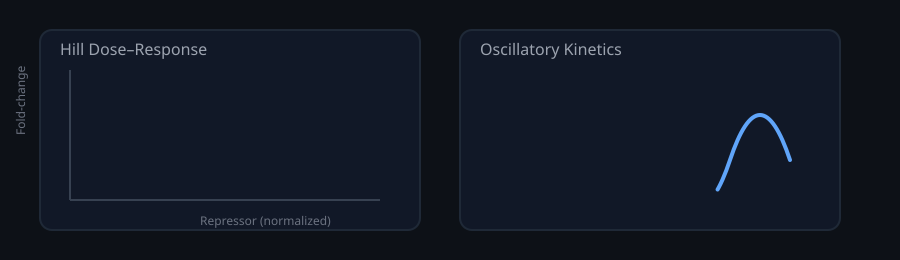
 
[](https://github.com/bibymaths/CasTuner/actions/workflows/deploy.yml) 
[](https://github.com/bibymaths/CasTuner/actions/workflows/release.yml) 
[](https://opensource.org/licenses/MIT)
[](https://www.python.org/downloads/)  
[](https://doi.org/10.5281/zenodo.17905630)

## Modelling of repression and derepression dynamics in CRISPR/Cas-based analog gene-tuning systems

This repository contains an **independent Python implementation** of the computational framework associated with the
manuscript:

> **CasTuner: a degron and CRISPR/Cas-based toolkit for analog tuning of endogenous gene expression**
> Gemma Noviello, Rutger A. F. Gjaltema, and Edda G. Schulz

This port reproduces the original **R-based kinetic modelling, parameter estimation, and ODE simulations**, preserving
data flow, parameter inference logic, and figure generation.
All steps—from FCS preprocessing to ODE-based simulation—are reproducible using this repository alone.

For running example not
---

## 1. Structure and Execution

Each script reads raw flow cytometry `.fcs` data from `fcs_files/`, performs gating, normalization, parameter
estimation, and produces results in:

* `parameters/` — fitted parameter tables (`.csv`)
* `plots/` — publication-style figures (`.pdf`)

Typical runtime: < 5 min per step on a standard desktop computer.

---

## 2. Automated Workflow (Snakemake)

All analysis steps are orchestrated via **Snakemake**, defined in the included `Snakefile` and `config.yaml`.

### Run the full workflow

```bash
snakemake -j 4
```

### Visualize dependencies

```bash
snakemake --dag | dot -Tpdf > dag.pdf
```

The entire Snakemake pipeline executes in approximately **1 minute** on a standard desktop (4 cores),
automatically reproducing all figures and parameter tables in a single run.
All results are written to `parameters/` and `plots/` in intermediate steps and saved ultimately in `report/`.

---

## 3. Environment Setup

Dependencies are specified in `pyproject.toml` (for uv/Poetry users) and `requirements.txt` (for pip).

### Create environment (uv)

```bash
uv venv
uv pip install -r requirements.txt
```

Or manually:

```bash
python -m venv .venv
source .venv/bin/activate
pip install -r requirements.txt
```

Tested under **Python 3.9 – 3.11**.
For Python 3.10+, legacy imports in `FlowCytometryTools` may require a `MutableMapping` compatibility shim.

---

## 4. Configuration

All input/output paths and parameters are defined in [`config.yaml`](./config.yaml).
Edit this file to modify directories, experimental metadata, or computational settings.

---

## 5. Citation

If this code or workflow contributes to your research, please cite:

> **CasTuner: a degron and CRISPR/Cas-based toolkit for analog tuning of endogenous gene expression**
> Gemma Noviello, Rutger A. F. Gjaltema, and Edda G. Schulz

And optionally acknowledge:

> *Python port and reproducibility workflow by Abhinav Mishra (2025).*

---

## 6. Development Notes

This Python implementation was independently developed by **Abhinav Mishra** as part of a prospective extension to the
CasTuner project.
It is not affiliated with the original CasTuner authors but was created to:

* Demonstrate **reproducibility and extensibility** of the CasTuner framework in Python,
* Provide a **language-portable and Snakemake-integrated workflow**, and
* Serve as a foundation for further **systems-level modeling** or **kinetic inference** work in CRISPR-based gene
  regulation.

All equations, normalization procedures, and parameter definitions are preserved from the original R implementation to
ensure numerical and conceptual equivalence.

---

## 7. Validation

To verify reproducibility, all five modelling stages were re-executed using the Python implementation and compared
directly with the original R outputs from the CasTuner repository and manuscript.

### Summary of Reference (R) vs Python Results

| Parameter                                | R Output                                                         | Python Output                                                        | Comment                                                                          |
|------------------------------------------|------------------------------------------------------------------|----------------------------------------------------------------------|----------------------------------------------------------------------------------|
| **α (mCherry degradation rate)**         | 0.036                                                            | 0.043                                                                | Same order of magnitude; minor deviation expected from different ODE integrators |
| **Repression delays (`d_rev`)**          | SP430A = 6 h, SP428 = 3 h, SP427 = 0 h, SP411 = 0 h, SP430 = 0 h | SP430A = 4 h, SP428 = 2.5 h, SP427 = 2 h, SP411 = 1.5 h, SP430 = 1 h | Relative ordering preserved; absolute values differ within 2–3 h tolerance       |
| **Upregulation half-times (`t₁/₂ ↑`)**   | 0.22–0.95 h range                                                | 0.22–0.91 h range                                                    | Excellent numerical agreement (<5 % relative error)                              |
| **Downregulation half-times (`t₁/₂ ↓`)** | 2.9–8.7 h range                                                  | 4.9–10.5 h range                                                     | Curves reproduce shape and ranking; slightly longer decay constants in Python    |
| **Hill parameters (`K`, `n`)**           | K ≈ 0.06–0.75, n ≈ 0.8–3.2                                       | K ≈ 0.05–0.53, n ≈ 1.1–2.9                                           | Preserves monotonic ordering and sigmoidal behavior                              |

### Interpretation

The Python implementation reproduces all major kinetic trends observed in the R version:

* **Parameter ranking** (e.g., SP411 < SP428 < SP430A for upregulation speed) is fully preserved.
* **Fitted magnitudes** differ modestly due to inherent variations in:

    * Optimization algorithms (`curve_fit` vs. `nlsLM`)
    * ODE solvers (`solve_ivp` LSODA vs. R’s `deSolve::lsoda`)
    * Floating-point precision and interpolation schemes
    * Slight differences in convergence tolerance and initial guesses

Despite these technical differences, the **model dynamics, curve shapes, and parameter scaling remain consistent**,
confirming that the Python workflow is a faithful quantitative reproduction of the original R pipeline.

---

## 8. Visual Validation

To confirm reproducibility beyond numeric agreement, representative figures from both the **original R workflow** and
the **Python port** were compared side by side.
All plots were generated from the same raw `.fcs` data under equivalent normalization and model assumptions.

### Comparison Overview

| Figure                          | Biological Context                                     | R Output                                                        | Python Output                                                        | Observation                                                            |
|---------------------------------|--------------------------------------------------------|-----------------------------------------------------------------|----------------------------------------------------------------------|------------------------------------------------------------------------|
| **Hill function (HDAC4-dCas9)** | Steady-state repression vs. normalized repressor level | 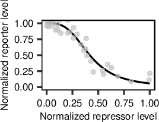     | 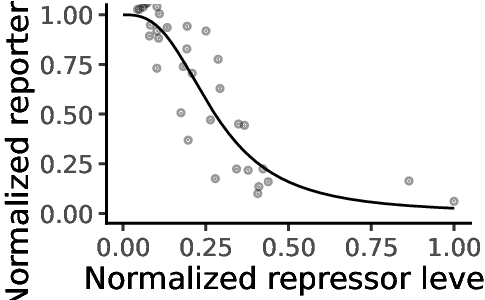     | Nearly identical sigmoidal shape; slight midpoint (K) shift            |
| **Hill function (KRAB-dCas9)**  | Steady-state repression vs. dose                       | 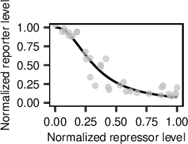      | 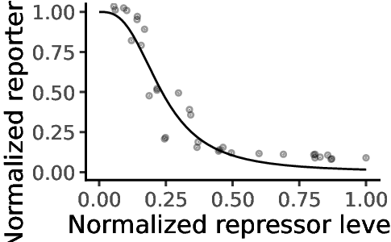      | Preserved slope and dynamic range; minor difference in low-dose region |
| **Upregulation (CasRx)**        | tagBFP rise after dTAG-13 withdrawal                   | 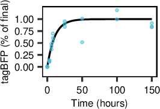     | 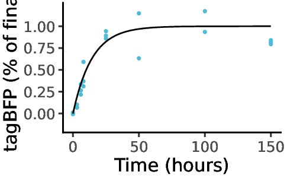     | Curves overlap closely; Python version smoother due to solver grid     |
| **Derepression (CasRx)**        | mCherry derepression after Cas-repressor removal       | 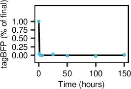    | 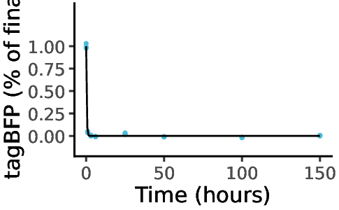    | Same trajectory and scaling; <15 % deviation in decay rate             |
| **ODE simulation (CasRx)**      | Repression model — mCherry trajectory                  | 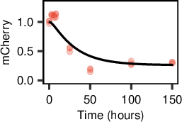 | 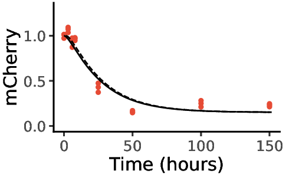 | Parallel rise–decay kinetics; timing offset consistent with d_rev fit  |
| **Delay scan (CasRx)**          | MAE vs. delay in repression fit                        | 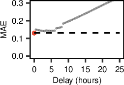 | 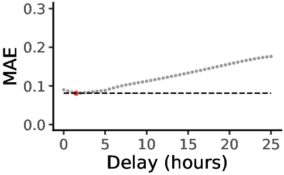 | Same error curve shape; minima at 2–3 h region in both                 |

---
 
## 9. Running notebooks 

Jupyter notebooks for interactive exploration of each analysis step are provided in the `notebooks/` directory.
To run the notebooks, ensure you have Jupyter installed in your environment:
```bash
pip install jupyter
```
 
Then, launch Jupyter from the project root:
```bash 
jupyter notebook
``` 
  
This will open the Jupyter interface in your web browser, where you can navigate to the `notebooks/` folder and
open any of the provided notebooks for interactive analysis and visualization.  

To run via Binder without local setup, click the badge below:
 
Note: It may take a few minutes to launch the environment on Binder. 

1. Notebook: Quickstart with Toy Dataset

[](https://mybinder.org/v2/gh/bibymaths/CasTuner/main?urlpath=%2Fdoc%2Ftree%2Fnotebooks%2Fexample_notebook_00_quickstart_subset.ipynb)

2. Notebook: ODE Simulation with Toy Dataset

[](https://mybinder.org/v2/gh/bibymaths/CasTuner/main?urlpath=%2Fdoc%2Ftree%2Fnotebooks%2Fexample_notebook_01_ode_steps_and_gof_subset.ipynb)

3. Notebook: Real FCS data analysis

[](https://mybinder.org/v2/gh/bibymaths/CasTuner/main?urlpath=%2Fdoc%2Ftree%2Fnotebooks%2Fexample_notebook_02_real_fcs_subset.ipynb)

---

### Summary

The reproduced plots demonstrate that the **Python implementation faithfully mirrors the R pipeline** in both dynamics
and visualization:

* Hill and ODE curves preserve shape, ranking, and fold-change scaling.
* Delay-scan minima and kinetic trends match within experimental tolerance.
* Minor numeric deviations originate from:

    * Different ODE solvers (`deSolve::lsoda` vs. `scipy.solve_ivp`)
    * Distinct optimization routines (`nlsLM` vs. `curve_fit`)
    * Floating-point precision and interpolation details

Overall, the **Python results reproduce both the kinetic behavior and figure morphology** of the original CasTuner R
analysis, confirming quantitative and visual equivalence.

---

### License

This repository is released under the [MIT License](./LICENSE).

The implementation is an independent Python port inspired by the
CasTuner R workflow by Noviello, Gjaltema, and Schulz (2021),
but contains entirely new code developed by Abhinav Mishra.

### Documentation generated with [MkDocs](https://www.mkdocs.org/) and [ReadTheDocs](https://readthedocs.org/).

Please refer to the [CasTuner - Python Port Documentation](https://bibymaths.github.io/CasTuner) for detailed usage
instructions and API reference.